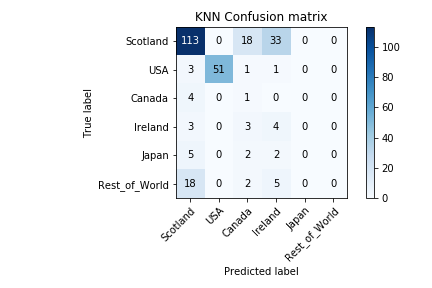
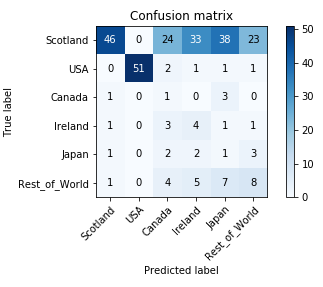
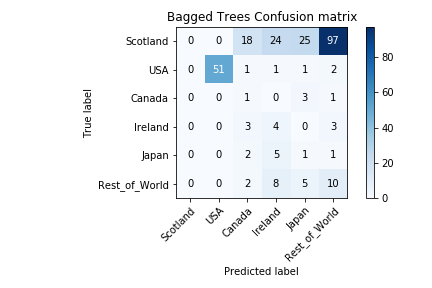
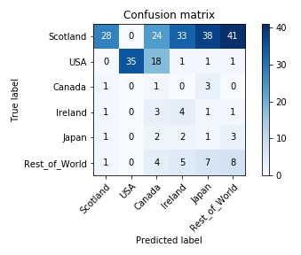
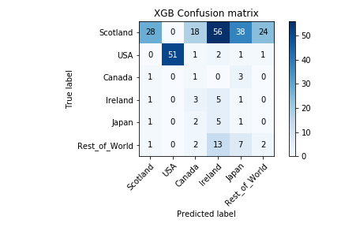

# project_whisky

Welcome to Project Whisky.  In this project, we will be attempting to classify whiskies by their country of origin based on their flavor profile, ingredient type, and whiskey type.

## Data

Data is sourced from Whiskeyanalysis.com.  Data consisted of 1600 individual whiskies, and ranged from the following:

Target:   
Countries - Scotland, USA, Canada, Ireland, Japan, Sweden, India, Taiwan, Wales, Switzerland, Finland, Tasmania, South Africa, Netherlands, England, Belgium, France.  
Features (kept):  
Cluster: A, B, C, D, E, F, G, H, I, J, R0, R1, R2, R4.  
Class - Single-Malt like, Blend, Rye-like, Bourbon-like.   
Type - Malt, Blend, Grain, Rye, Wheat, Barley, Bourbon, Flavored
Features (discarded):
Super Cluster: amalgamation of flavors that whiskey posseses (discarded in favor of single flavor due to low diversity)
Whiskey: name of individual whiskey
metascore: average score of whiskey based on multiple review sites
STDEV: standard deviation of whiskey based on multiple review sites
reviews: number of reviews observed and used for metascore
Cost: approximate cost of whiskey in $

## EDA

Initial problems I encountered with the data were in properly classifying my data.  I first needed to convert countries into number values, which was a simple replace.  Due to the massive imbalance between Scotch whiskies and the whiskies produced from the rest of the world, I also grouped the 11 least populous whiskies and grouped them as "rest_of_world," keeping Scotland, USA, Canada, Ireland, and Japan.
Prior to reorganizing, countries were broken up into the following:  

In addition, the original dataset creator chose to rank Bourbons based on their Rye content, as bourbon tends to follow a set flavor characteristic, and is particularly distinguishable by its rye content, which gives rye whiskies its distinctive "spiciness."  In order to better train the model and avoid automatically identifying "R's" as bourbon, I needed to translate the "R's" into a more streamlined format based on the general flavor profile of bourbons based on the pre-existing flavor categories, taking spiciness into account.  Thus the final transformation was lined up thusly:

RO = B
R1 = A
R2 = E
R3 = C
R4 = F

Lastly, dummies were created for all remaining categorical values.

## Modeling

Data was prepped with standard train_test_split libarary, then SMOTEd to compensate for the overweighted Scotch.

Standard DummyClassifier using Uniform method to test predicting uniformly at random or "man on the street" testing produced a result of 17% for Precision and Recall score, establishing out baseline.

The following Models were then tested with various parameters producing the following best results and confusion matrices:

KNN:  
Precision:  43.5%  
Recall:  42.2%  

Decision Trees:  
Precision:  35%  
Recall:  33%  

Regression Trees:  
Precision:  19%  
Recall:  33%  

Bagged Trees:  
Precision:  21%  
Recall:  34%  

Random Forest:  
Precision:  19%  
Recall:  32% 

AdaBoost:
Precision:  36%  
Recall:  30%  

Gradient Boost:
Precision:  37%  
Recall:  36%  

XGBoost:  
Precision:  44%  
Recall:  40%  

Support Vector Machines:  
Precision:  40%  
Recall:  44%  

