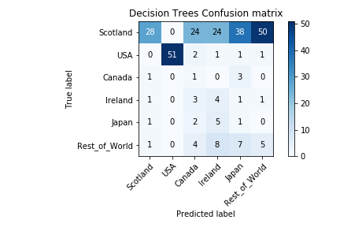
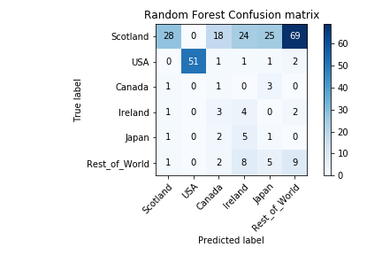
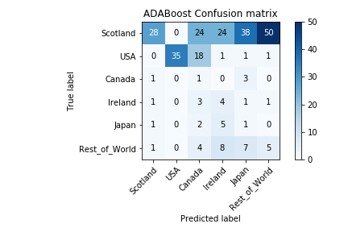

# project_whisky

Welcome to Project Whisky.  In this project, we will be attempting to classify whiskies by their country of origin based on their flavor profile, ingredient type, and whiskey type.

## Data

Data is sourced from Whiskeyanalysis.com.  Data consisted of 1600 individual whiskies, and ranged from the following:

Target:   
Countries - Scotland, USA, Canada, Ireland, Japan, Sweden, India, Taiwan, Wales, Switzerland, Finland, Tasmania, South Africa, Netherlands, England, Belgium, France.  
Features (kept):  
Cluster: A, B, C, D, E, F, G, H, I, J, R0, R1, R2, R4.  
Class - Single-Malt like, Blend, Rye-like, Bourbon-like.   
Type - Malt, Blend, Grain, Rye, Wheat, Barley, Bourbon, Flavored
Features (discarded):
Super Cluster: amalgamation of flavors that whiskey posseses (discarded in favor of single flavor due to low diversity)
Whiskey: name of individual whiskey
metascore: average score of whiskey based on multiple review sites
STDEV: standard deviation of whiskey based on multiple review sites
reviews: number of reviews observed and used for metascore
Cost: approximate cost of whiskey in $

## EDA

Initial problems I encountered with the data were in properly classifying my data.  I first needed to convert countries into number values, which was a simple replace.  Due to the massive imbalance between Scotch whiskies and the whiskies produced from the rest of the world, I also grouped the 11 least populous whiskies and grouped them as "rest_of_world," keeping Scotland, USA, Canada, Ireland, and Japan.
Prior to reorganizing, countries were broken up into the following:  

In addition, the original dataset creator chose to rank Bourbons based on their Rye content, as bourbon tends to follow a set flavor characteristic, and is particularly distinguishable by its rye content, which gives rye whiskies its distinctive "spiciness."  In order to better train the model and avoid automatically identifying "R's" as bourbon, I needed to translate the "R's" into a more streamlined format based on the general flavor profile of bourbons based on the pre-existing flavor categories, taking spiciness into account.  Thus the final transformation was lined up thusly:

RO = B
R1 = A
R2 = E
R3 = C
R4 = F

Lastly, dummies were created for all remaining categorical values.

## Modeling

Data was prepped with standard train_test_split libarary, then SMOTEd to compensate for the overweighted Scotch.

Standard DummyClassifier using Uniform method to test predicting uniformly at random or "man on the street" testing produced a result of 17% for Precision and Recall score, establishing out baseline.

The following Models were then tested with various parameters producing the following best results and confusion matrices:

KNN:  
Precision:  43.5%  
Recall:  42.2%  

Decision Trees:  
Precision:  35%  
Recall:  33%  

Regression Trees:  
Precision:  19%  
Recall:  33%  

Bagged Trees:  
Precision:  21%  
Recall:  34%  

          
Random Forest:  
Precision:  19%  
Recall:  32%   

AdaBoost:  
Precision:  36%  
Recall:  30%  

Gradient Boost:  
Precision:  37%  
Recall:  36%  

XGBoost:  
Precision:  44%  
Recall:  40%  

Support Vector Machines:  
Precision:  40%  
Recall:  44%  

## Conclusions

In the end, despite KNN's high score, its distribution of True Positives and False Negatives was not desireable.  In the goal of being able to randomly sort, I wanted to see more homoscedasticity.  Given how overweight the data is in Scotch, I wanted this data to exhibit more Type I errors, rather than just allocating everything to scotch as is evident in the KNN confusion matrix.  This might have improved my accuracy, but ends up being a poor classification model.  SVM delivered the homoscedastcity I was looking for while still having high enough Precision and Recall scores, so SVM was designated as the best performing model.

Its worth noting that the difficulty in modeling this classification exercise may be due in large part to market forces.  Scotch is widely recognized as the gold standard for whiskeys globally.  Those looking to set up competing distilleries in their home country and looking to make a name for themselves typically follow the Scottish model for establishing their equipment.  Then, in order to create a viable product, further seek to emulate the distinctive Scotch flavor profile in order to maximize success and drinker appeal.  One could look at the Japanese model for such an example.  Masataka Taketsuru, widely known as the father or Japanese Whiskey worked in Scottish distilleries for years before returning home to Japan to start his own distillery.  Anecdotes from the time say that Taketsuru copied the Scottish model down to its very last detail, including making sure the very first still created in Japan replicated those he had seen, down to the dimensions of the centuries old dents he observed on the stills in Scotland.  

Once a viable product an income stream has been established, these other distilleries may allow themselves to experiment with their production process and seek to create new and interesting flavors that may have more appeal to their domestic markets.  In the America for example, American whiskey production has changed both by locally available ingredients and enough time and distance from the motherland to create their own distinctive take on whiskey, bourbon.  With an enormous and loyal domestic customer base, there is little need for American to emulate the Scottish model and they are content with producing a product with their distinctive flavor profile.  Time will tell if distilleries in other countries will eventually settle on their own brand of flavor.

Further difficulties were revealed in conversations with industry experts.  I spoke with Olivier Bugat of Casamigos Tequila regarding the models created and he pointed out that the flavor profiles used to categorize whiskeys was insufficient in properly taking into account its national origin.  Variations such as equipment shape, local air quality, elevation, and temperature all effect the ultimate flavor of whiskey.  Each of these variations results in the inclusion or exclusion of hundreds of chemical components that will ultimately affect the final product.  Liquid and Gas Chromatography is used these days to analyze the "finger print" of whiskey to identify its origin and it is my hope to one day be able to access this data and further refine my models.

